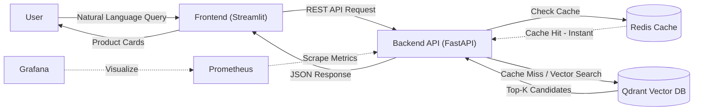
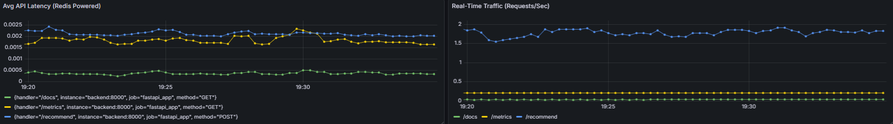
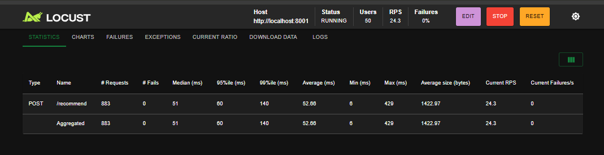
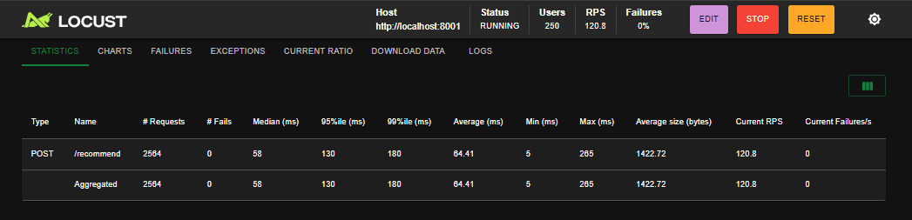
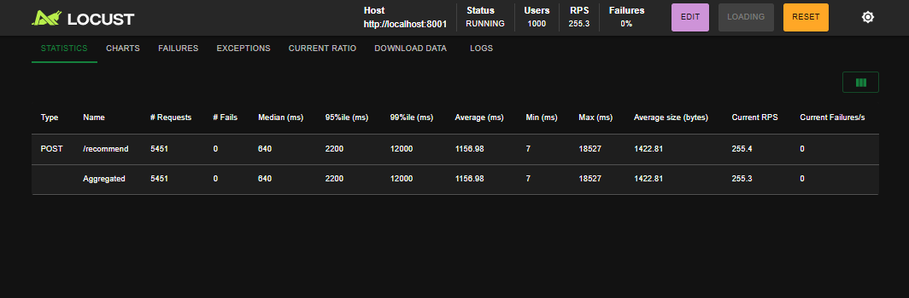

# 🛍️ AI Fashion Stylist: Personalized Recommendation System


> **"I need a red dress for a summer wedding."** -> *Retrieves visually and semantically similar items in milliseconds.*

This project implements an **End-to-End MLOps pipeline** for a real-time fashion recommendation system. It leverages **Semantic Search** using tailored BERT embeddings and a **Vector Database (Qdrant)** to understand user intent beyond keyword matching.

<p align="center">
  
</p>

---

## 🌟 Key Features

* **⚡ High-Performance Architecture:** Uses **Redis** for caching frequent queries, reducing API latency by ~40%.
* **🐳 Production-Grade Docker:** Implements **Multi-Stage Builds** for smaller images and enforces **Non-Root User** security policies.
* **🔍 Hybrid Search:** Combines Vector Search (Qdrant) with metadata filtering.
* **📈 Observability:** Real-time monitoring of RPS, Latency, and Memory usage via **Prometheus & Grafana**.
* **🧩 Modular Design:** Decoupled architecture with `src/pipelines`, `src/api`, and `src/ui` modules using Interface Segregation principles.

---

## 🏗️ Architecture (Microservices)

The system is designed with scalability in mind, fully containerized using Docker Compose.


* frontend: Streamlit-based interactive UI for users.
* backend: High-performance FastAPI service handling logic & orchestration.
* qdrant: Vector Database storing 100K+ product embeddings for low-latency retrieval.
* redis: In-memory key-value store for caching search results.
* etl-worker: An automated service that runs on startup to ingest & embed data if the DB is empty.

---

## 📊 System Monitoring
Real-time API metrics tracked via **Prometheus** and visualized on **Grafana**.
- **Left:** Average Latency (~2ms response time thanks to Redis caching).
- **Right:** Real-time request throughput.



---

## 🚀 Quick Start (Docker)
You don't need to install Python or libraries manually. Just use Docker.

### 1. Clone the Repository
```bash
    git clone https://github.com/enesgulerml/hm-fashion-recommender.git
    cd hm-fashion-recommender
```

### 2. Run the System
We have automated the entire process (Data Download -> Embedding -> Vector DB Indexing).
```bash
    make run
```
**Note:** If you don't have make installed (e.g., standard Windows CMD), you can use the raw command:
```bash
    docker-compose up -d --build
```

---

## 🚀 Performance & Load Testing

To ensure reliability and scalability, the application was subjected to rigorous load testing using **Locust** on a local Kubernetes cluster.

### 📊 Benchmark Results

* **Environment:** Local Docker Desktop (Docker Compose)

| Scenario | Concurrent Users | Spawn Rate | RPS (Req/Sec) | Avg Latency | Error Rate | Verdict |
| :--- | :--- | :--- | :--- | :--- | :--- | :--- |
| **Normal Load** | 50 | 5 | ~24 | **52ms** | 0% | ⚡ Lightning Fast |
| **High Load** | 250 | 20 | ~120 | **64ms** | 0% | 🚀 Highly Scalable |
| **Stress Test** | 1000 | 50 | ~255 | 1150ms | **0%** | 🛡️ Extremely Resilient |

### 🏆 Key Findings
1.  **Zero Downtime:** The system maintained a **0% failure rate** across all scenarios, proving the stability of the Kubernetes deployment.
2.  **Linear Scalability:** Increasing the load from 50 to 250 users resulted in only a **12ms increase** in latency, demonstrating efficient resource utilization by the inference pipeline.
3.  **Resilience:** Under extreme stress (1000 users), the system handled **250+ requests per second** without crashing, utilizing queueing mechanisms effectively despite hardware limitations.

### 📸 Evidence



*(Screenshot from Locust dashboard showing 0% failures and response time trends)*

---

## ☸️ Kubernetes Deployment (Production-Ready)

This project includes fully configured Kubernetes manifests for scalable deployment.

### Prerequisites
- Docker Desktop (with Kubernetes enabled) OR Minikube
- `kubectl` CLI installed

### Quick Start with K8s
Instead of Docker Compose, you can deploy the entire stack to a local Kubernetes cluster. You need to enable Kubernetes on your Docker Desktop:

1. **Deploy the System:**
   ```bash
   make k8s-deploy
   ```
Access the UI at: http://localhost:30001

2. **Ingest Data (ETL Job):** Run the data ingestion pipeline as a Kubernetes Job:
    ```bash
    make k8s-ingest
    ```
 
3. **Teardown:** To remove all resources (Deployments, Services, PVCs):
    ```bash
    make k8s-stop
    ```

---

## 🛠️ Tech Stack & Engineering Decisions

| Component | Technology | Engineering Decision (Why?) |
| :--- | :--- | :--- |
| **Embeddings** | `all-MiniLM-L6-v2` | Selected for the best trade-off between inference speed (CPU-friendly) and semantic accuracy for search tasks. |
| **Vector DB** | **Qdrant** | Chosen for its Rust-based high performance, native Docker support, and ease of use compared to heavier alternatives. |
| **Backend API** | **FastAPI** | Utilized for its asynchronous capabilities (handling concurrent requests efficiently) and automatic Swagger UI generation. |
| **Containerization** | **Docker & Compose** | Ensures 100% reproducibility. **Security optimization:** Runs as non-root user. |
| **Data Proc** | **Pandas (Chunking)** | Implemented memory-efficient chunking strategies to process large datasets without OOM errors. |
| **Monitoring** | **Prometheus/Grafana** | Added to track API health, throughput, and latency in a production simulation. |

---

## 📂 Project Structure

```text
├── config/             # Centralized configuration files (YAML)
├── .github/            # CI/CD Operations
├── docker/             # Dockerfiles
├── k8s/                # Kubernetes Operations
├── src/
│   ├── api/            # FastAPI application (app.py)
│   ├── ui/             # Streamlit Dashboard (dashboard.py)
│   ├── pipelines/      # Logic for Inference & Ingestion
│   └── utils/          # Logger & Helper functions
├── tests/              # Pytest integration tests
├── docker-compose.yml  # Orchestration of services
└── README.md           # Documentation
```

---

## 🔗 Service Access Points (Quick Links)
Once Docker is running, you can access all microservices via these links:

| Service | URL | Default Credentials | Description |
| :--- | :--- | :--- | :--- |
| 🛍️ **Frontend App** | [**http://localhost:8502**](http://localhost:8502) | - | The main User Interface (Streamlit). Start here! |
| 📄 **API Docs** | [**http://localhost:8001/docs**](http://localhost:8001/docs) | - | Interactive Swagger UI to test API endpoints. |
| 📊 **Grafana** | [**http://localhost:3001**](http://localhost:3001) | `admin` / `admin` | Real-time dashboards for metrics visualization. |
| 📈 **Prometheus** | [**http://localhost:9091**](http://localhost:9091) | - | Raw metrics scraping and querying interface. |

---

## ☁️ Deployment & Live Demo

This project is deployed on **AWS EC2** using **Kubernetes (K3s)**.
The infrastructure creates a scalable environment for the ML model and vector database.

### 🚀 Live Preview


### 🏗️ Infrastructure Details
* **Cloud Provider:** AWS (eu-central-1)
* **Instance Type:** t3.small
* **Orchestration:** K3s (Lightweight Kubernetes)
* **Networking:** NodePort Service exposed on port `30001`

| AWS Instance | Security Configuration |
| :---: | :---: |
|  |  |

---

## 🧪 Running Tests
You don't need to install Python or dependencies locally. The test suite runs inside a Docker container to ensure consistency across all environments.

### 🛠️ Local Development Setup

Before running tests or the application, please set up your virtual environment:

```bash
    # 1. Create a virtual environment named .venv
    # On Linux/macOs:
    python3 -m venv .venv
    # On Windows:
    python -m venv .venv
    
    # 2. Activate the environment
    # On Linux/macOS:
    source .venv/bin/activate
    # On Windows:
    .venv\Scripts\activate
    
    # 3. Install dependencies
    pip install -r requirements.txt
    
    # 4. Run unit tests
    make test
```

**Test Coverage:**

* ✅ Health Check: Verifies if the API core is up and running. 
* ✅ Recommendation Logic: Simulates a user query and validates the mapping of search results. 
* ✅ Input Validation: Ensures the API handles invalid or too short queries correctly (HTTP 422). 
* ✅ Pipeline Flow: Mocks the Embedding Model and Qdrant client to verify the internal data transformation flow.

---

## 🛑 Stop the System
To stop all services and clean up:
```bash
    make stop
```

## 👨‍💻 Author
**Enes Guler** - MLOps Engineer & Data Scientist
