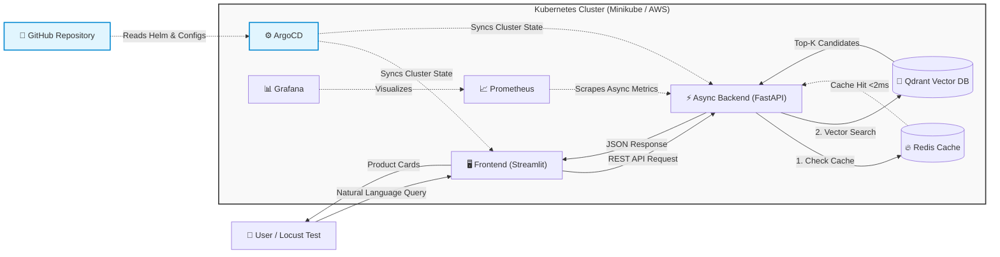
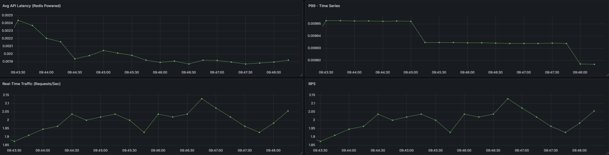
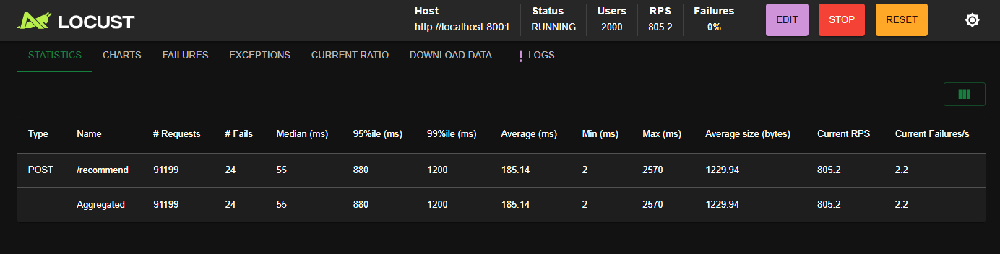
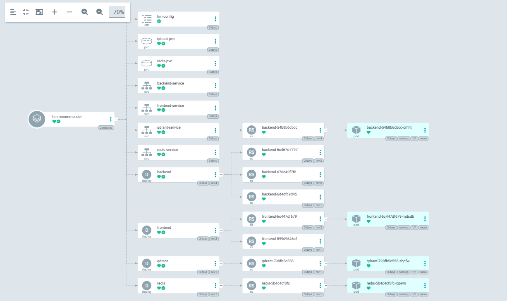
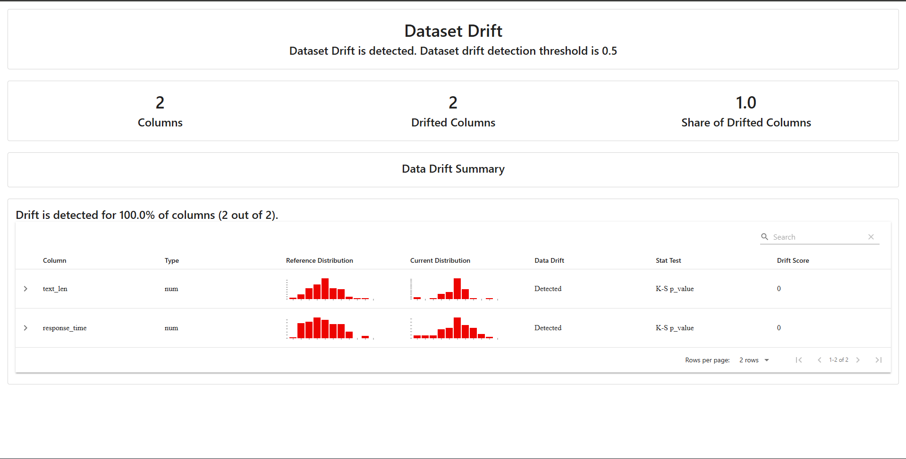
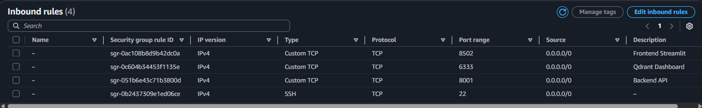

# AI Fashion Stylist: Personalized Recommendation System


[](https://helm.sh/)
[](https://argo-cd.readthedocs.io/)


> **"I need a red dress for a summer wedding."** -> *Retrieves visually and semantically similar items in milliseconds.*

This project implements an **End-to-End MLOps pipeline** for a real-time fashion recommendation system. It leverages **Semantic Search** using tailored BERT embeddings and a **Vector Database (Qdrant)** to understand user intent beyond keyword matching.

<p align="center">
  
</p>

# Session: Architecture, Impact & Proof
*This section highlights the system design, performance benchmarks, and deployment strategies.*

## 🏗️ Microservices Architecture
The system is designed with scalability in mind, fully decoupled into independent microservices.



## ⚡ High-Performance API & Reliability
The backend was completely refactored to an asynchronous architecture to prevent blocking during AI model inference and database operations.

* **Redis Caching:** Slashes inference latency to <2ms on cache hits.



* **Extreme Stress Tested:** Validated via Locust on a local Kubernetes cluster.

* **Results:** Sustained 805 RPS (~2.9M requests/hour) under 2,000 concurrent users with a 0% error rate.



## 🔄 GitOps & Continuous Deployment (ArgoCD)
To eliminate manual deployment bottlenecks, this project fully embraces the GitOps philosophy. The cluster state is entirely declarative and managed via Helm charts.

* **Single Source of Truth:** Any changes to the GitHub repository automatically trigger a synchronization.



* **Zero-Downtime:** ArgoCD reconciles the cluster state without manual kubectl interventions.

## 📊 Observability & Drift Monitoring
Comprehensive monitoring stacks are integrated to track both system health and machine learning metrics.

* **Prometheus & Grafana:** Real-time API throughput, latency, and memory tracking.

* **Evidently AI:** Real-time Data Drift monitoring for the embedding model.



## ☁️ Cloud Deployment (AWS)
The project is not just local; it is fully capable of running in the cloud. It was successfully deployed on an AWS EC2 (t3.small) instance utilizing K3s (Lightweight Kubernetes).




# Session: Developer Guide
Instructions for reproducing the environment, running tests, and deploying the system locally.

## 🚀 Quick Start (Docker Compose)
The easiest way to run the project. You don't need Python installed locally, just Docker and Make.

```bash
    # 1. Clone the Repository
    git clone https://github.com/enesgulerai/hm-fashion-recommender.git
    cd hm-fashion-recommender

    # 2. Run the System (Automates Data Ingestion -> Embedding -> DB Indexing)
    make run
    # Note: If you don't have make installed (e.g., standard Windows CMD), you can use the raw command:
    docker-compose up -d --build

    # 3. Stop the System
    make stop
```

## ☸️ Kubernetes Deployment (Local)
For testing the production-ready Helm charts and Kubernetes manifests locally (requires Docker Desktop K8s or Minikube).

```bash
    # Deploy the entire stack
    make k8s-deploy

    # Watch Logs
    make k8s-logs

    # Teardown all K8s resources
    make k8s-stop
```

## 🔗 Service Access Points
Once the system is up, you can access the microservices here:

| Service          | URL | Default Credentials | Description |
|:-----------------| :--- | :--- | :--- |
| **Frontend App** | [**http://localhost:8502**](http://localhost:8502) | - | The main User Interface (Streamlit). Start here! |
| **API Docs**     | [**http://localhost:8001/docs**](http://localhost:8001/docs) | - | Interactive Swagger UI to test API endpoints. |
| **Grafana**      | [**http://localhost:3001**](http://localhost:3001) | `admin` / `admin` | Real-time dashboards for metrics visualization. |
| **Prometheus** | [**http://localhost:9091**](http://localhost:9091) | - | Raw metrics scraping and querying interface. |
| **Kubernetes UI** | [**http://localhost:30001**](http://localhost:30001) | - | Main Streamlit interface exposed via K8s NodePort. Use this for cluster deployments. |


## 🧪 Local Development & Testing
If you want to run the tests or develop locally outside of Docker:
```bash
    # 1. Setup Virtual Environment
    python -m venv .venv
    source .venv/bin/activate  # Or .venv\Scripts\activate on Windows

    # 2. Install Dependencies
    make install

    # 3. Run the Pytest Suite
    make test
```

# 🛠️ Troubleshooting & Common Issues

**1. `make: command not found` (Windows Users)**
* **Symptom:** PowerShell or CMD throws an error that `make` is not recognized.
* **Solution:** Windows does not come with `make` pre-installed. You have two options:
  * **Option A (Bypass):** Run the raw Docker command instead: `docker compose up -d --build`
  * **Option B (Install):** Install `make` via Windows package managers:
    * `winget install ezwinports.make` OR `choco install make`

**2. Docker Daemon is Not Running**
* **Symptom:** `error during connect: This error may indicate that the docker daemon is not running.`
* **Solution:** Ensure Docker Desktop is launched and the Docker engine is running in the background before executing the Makefile.

**3. Port is Already Allocated**
* **Symptom:** `Bind for 0.0.0.0:8001 failed: port is already allocated.`
* **Solution:** Another service on your machine is using one of the required ports (8001, 8502, 6333, etc.). You can either stop that service or modify the port mappings in the `docker-compose.yml` file.

**4. Out of Memory (OOM) Errors (Qdrant or Embeddings)**
* **Symptom:** The `etl-worker` or `qdrant` container crashes unexpectedly during startup.
* **Solution:** Processing 100K+ embeddings can be memory-intensive. Ensure your Docker Desktop is allocated at least **4GB to 6GB of RAM** in its settings.


## 👨‍💻 Author
**Enes Guler** - MLOps Engineer
